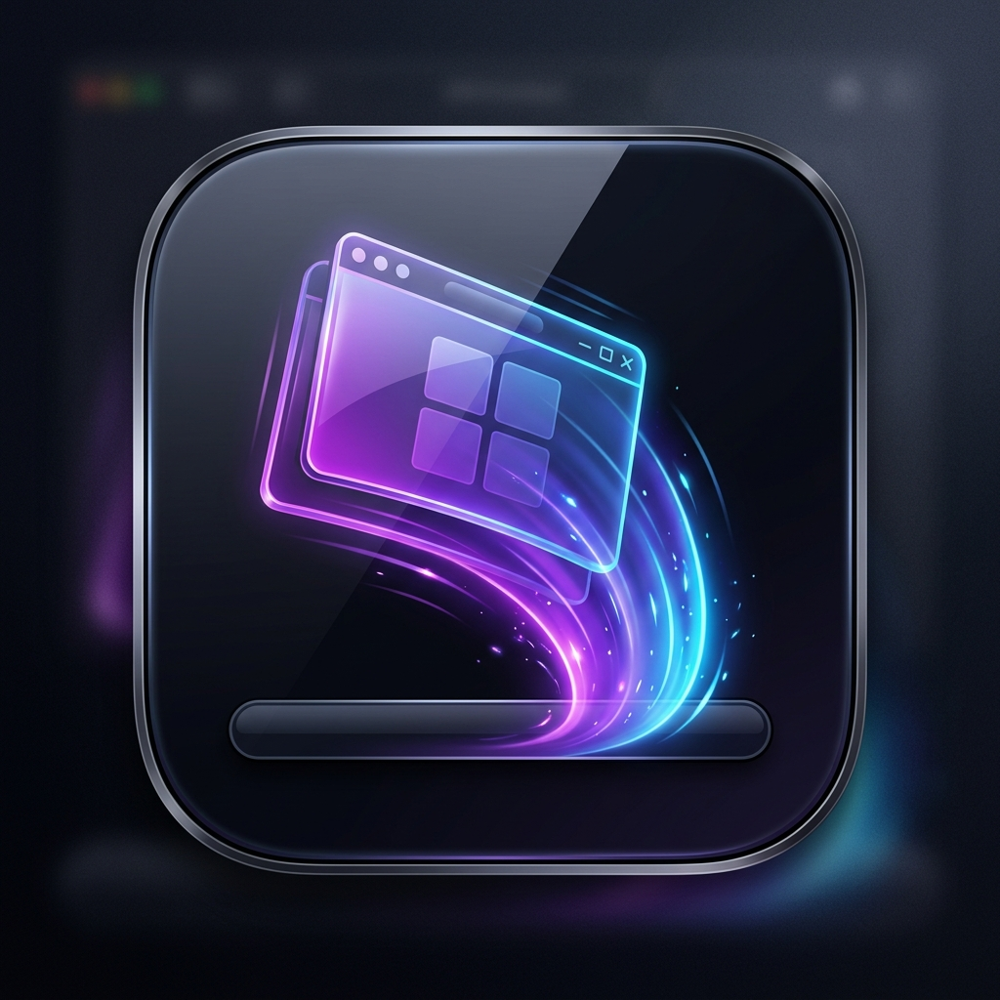

#  DockMinimize

**DockMinimize** is a lightweight, premium macOS utility that runs silently in your menu bar and adds toggle minimization & restoration behavior to Dock clicks—bringing the beloved functionality of Click2Minimize back to modern macOS.

---

## ✨ Features

- **🔄 Dock-Click Toggle**:
  - **Click to Minimize**: Clicking the Dock icon of the currently active app immediately minimizes its window to the Dock.
  - **Click to Restore**: Clicking the Dock icon of an app with minimized windows immediately restores/unminimizes its windows.
- **🧠 State-Aware Engine**: Uses native macOS Accessibility APIs to detect whether an app has visible or minimized windows, preventing double-triggering or activation loops.
- **🚀 Silent Background Mode**: Runs quietly in the menu bar with no dock icon or onboarding window, keeping your workspace clean.
- **🛠️ Native Menu Bar Controls**:
  - **Left-click** the menu bar icon to show settings, about, and quit actions.
  - Custom template styling adjusts dynamically to light and dark macOS menu bars.
- **⚡ Launch at Login**: Configurable option to start the app automatically when you log in.

---

## 🚦 System Requirements

- **macOS Sonoma (14.0)** or newer.
- **Accessibility Permissions**: The app requires Accessibility access to interact with other application windows.

---

## 🛠️ How to Build and Run

1. Clone or download this repository.
2. Open `DockMinimize.xcodeproj` in Xcode.
3. Choose the target **DockMinimize** (My Mac).
4. Press `Cmd + B` to build the app, or `Cmd + R` to run it.
5. Once launched, you will see the template icon in your menu bar at the top right.

---

## 🔐 Granting Accessibility Permissions

To allow **DockMinimize** to control application windows:

1. Click the **DockMinimize** icon in the menu bar and select **Settings...**.
2. Under **Accessibility Permission**, click **Grant Access in System Settings**.
3. You will be redirected to **System Settings > Privacy & Security > Accessibility**.
4. Enable the toggle next to **DockMinimize**.
5. *Note: If macOS blocks Accessibility queries (showing `-25204` in console diagnostics), toggle the permission off and on again or delete and re-add the app in System Settings to refresh the database.*

---

## 📝 License

Distributed under the MIT License. See `LICENSE` for more information.
